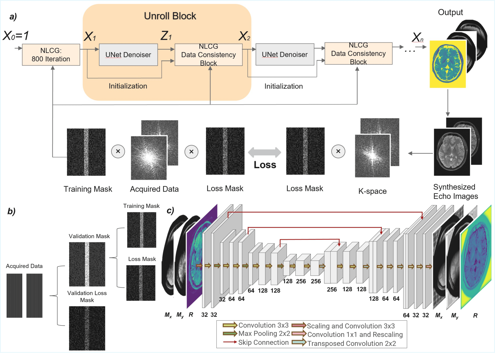

# NLCG-Net: A Model-Based Zero-Shot Learning Framework for Undersampled Quantitative MRI Reconstruction

Official implementation of **NLCG-Net** for undersampled quantitative MRI (qMRI) reconstruction,  
as described in:

> Xinrui Jiang, Yohan Jun, Jaejin Cho, Mengze Gao, Xingwang Yong, Berkin Bilgic,  
> *NLCG-Net: A Model-Based Zero-Shot Learning Framework for Undersampled Quantitative MRI Reconstruction*,  
> accepted by ISMRM 2024.

Paper (arXiv): [https://arxiv.org/abs/2401.12004](https://arxiv.org/abs/2401.12004)

The repository currently provides implementations for both **T2 mapping** (`T2`) and **T1 mapping** (`T1`).

---

## Overview

  

NLCG-Net is a **model-based zero-shot learning** framework that directly estimates T1/T2 quantitative maps from undersampled k-space data, instead of following the conventional two-step “reconstruct-then-fit” pipeline, thereby reducing bias and error propagation. It unrolls a nonlinear conjugate gradient optimization with a light U-Net regularizer that is trained in a scan-specific, self-supervised fashion using mono-exponential signal models, enabling high-fidelity T1 and T2 mapping without external training data. Experiments on highly accelerated T2 and T1 mapping demonstrate improved estimation quality and reduced artifacts compared to subspace reconstruction, especially at higher acceleration factors.
---

## Status

- **1/2024 update:** the codebase is being reorganized to be more reader-friendly.  
  - `T1/` contains code for T1 mapping.  
  - `T2/` contains code for T2 mapping.  
  - The main differences lie in `data_consistency.py`, since T1 and T2 use different signal models and raw data.

If you encounter any issues when running the code, please feel free to open an issue or submit a pull request.
